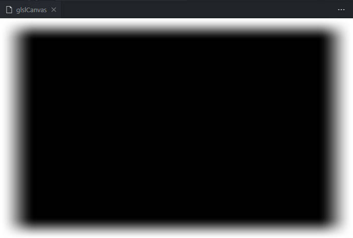

# 运行

1. vscode打开，安装`glsl-canvas`插件；
2. `ctrl+shift+p`，输入`Show glslCanvas`；
3. 运行；

## [demo.frag](./demo.frag)

## [Circle.frag](./Circle.frag)

* 圆

## [Sphere.frag](./Sphere.frag)

* 带光源的球体

* 环境光球

* 带光源的球体

* 带光源、阴影的球

## [Square.frag](./Square.frag)

* 方形

* 带虚边的方形

* 带虚边的方形

